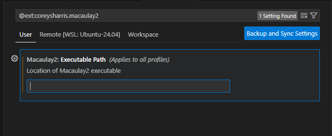

# Lazy Power Series
Power series rings implementation in Macaulay2

# Notes
## Installing WSL 
Macaulay2 only runs on Linux so far and for windows users one way to bypass this is to use the software called WSL (Windows Subsystem for Linux) that runs linux on a virtual machine. This is included in windows so it's not a third party software you have to install. 

First to install wsl, make sure you open a power shell with administrative privilages and run the command
```
$ wsl --install
```
If it ran successfully, it should say 
```
The requested operation is successful. Changes will not be effective until the system is rebooted.
```
As it says, do not forget to reboot!

Then you have to make sure WSL is enabled on your windows by going to Windows Features.

To choose the linux system, you can go to the windows store and install the appropriate one. As an example, I always go for ubuntu and currently I have Ubuntu 20.04 LTS installed. Note that you need to have WSL installed and enabled before you are able to use this. 

### Configuring Visual Studio Code
If you are using Visual Studio Code you shuld install the extension called Remote - WSL. you can find information on it here: [Remote - WSL - Visual Studio Marketplace](https://marketplace.visualstudio.com/items?itemName=ms-vscode-remote.remote-wsl)

It is a useful tool to be able to access Macaulay2 files on the linux machine while editting in Windows.

Run this periodically
```
$ sudo apt update
$ sudo apt upgrade
```

Once you're in the remote server, install git by typing this in the command line:
```
$ sudo apt-get install git
```

In case there is an error and you want to reset wsl so you can type this in your terminal:
```
$ wsl --shutdown
```
Afterwards, just start a new WSL window in Visual Code and it should work. 

### Fixing `viewHelp`
Viewing Macaulay2 documentation in a terminal is not recommended because of the way it shows up on the screen. This is why a better way to view documentation is to open the html files of the documentation in a browser. wsl originally comes with its own way of visualizing files, but the problem with wsl in Ubuntu 20.04 is that that the `wslview` command does not properly translate paths all the time, so we have to update it to the more modern wslu package which contains the new `wslview` command with the following code:

```
$ sudo add-apt-repository ppa:wslutilities/wslu
$ sudo apt install wslu
```

It might be required to set `WWWBROWSER` like so:
```
$ export WWWBROWSER=wslview
``` 

or save it for future sessions by running (basically go to `.bashrc` file and copy paste the above at the end):

```
$ echo "export WWWBROWSER=wslview" >> ~/.bashrc
```
We set both the WWWBROWSER and BROWSER variables to wslview so that it works with both emacs and Jupyter
```
$ echo "export BROWSER=wslview" >> ~/.bashrc
```

Now if you go to the terminal or emacs, the Macualy2 command `viewHelp` should open a browser in your Windows parent operating system.

## Installing Macaulay2
Before installing Macaulay2, you need to add the Macaulay2 ppa if you are on an Ubuntu version less than 21.04. 

```
sudo add-apt-repository ppa:macaulay2/macaulay2
```

Now you can install Macaulay2:
```
$ sudo apt install macaulay2
```

To check if it installed correctly, type in:
```
$ M2
```
You will need to do some initial setups after running M2 on the virtual machine for the first time:
```
$ setup()
```
and make sure to add the directory you cloned this repository into to the `PATH`. [Here is the link to the documentation.](http://www2.macaulay2.com/Macaulay2/doc/Macaulay2-1.18/share/doc/Macaulay2/Macaulay2Doc/html/_path.html) For example, if you clone it into your home directory, in my case `~/git`, I ran:
```
`path = append(path, "~/git/M2PowerSeries/")`; stack path
```

You find information on this here: [setup (macaulay2.com)](http://www2.macaulay2.com/Macaulay2/doc/Macaulay2-1.17/share/doc/Macaulay2/Macaulay2Doc/html/_setup.html)


## Setting up emacs
You can view the original instructions on the Macaulay 2 google group: https://groups.google.com/g/macaulay2/c/FXhHePFYhuA/m/MTz7qK5tAwAJ

You can run the no windows version of Macaulay2 in emacs, in a vscode terminal by following the next steps: 
First you need to navigate to your home directory (You can do this by using the command cd) and type in:
```
$ echo 'emacs -nw -f M2' >> M2script
$ chmod +x M2script
```
This will create a file named M2script that has the bash script where `-nw` runs emacs in tty (non-windows) mode.  The `-f M2` runs Macaulay2 on startup. 
Afterwards go to settings and type in macaulay2. It should say "Macaulay2: Executable Path" and copy paste the location of your bash script. (Technically if you had put it in your home directory then the path should look something like "/home/username/M2script". If you don't know what it is, type in the command `pwd` which tells you your current directory. 

If you want the window for emacs to not split and have a menu bar in tty mode, then add commands to your file like this:
```
$ echo "(add-hook 'emacs-startup-hook
          (lambda () (delete-other-windows)) t)
 (unless (display-graphic-p)
   (menu-bar-mode -1))" >> M2script
 ```
### Installing M2 extention on VSCode
In case you are using Visual Studio Code, I recommend installing this extension for Macaulay 2: https://github.com/coreysharris/vscode-macaulay2
For the extension, go into the settings and update the Macaulay2: Executable Path and type in the path to the M2script in the Location of Macaulay2 executable. 


Once this is done, you can now start M2 in emacs by pressing `F12` from the LazyPowerSeries folder location (You can make sure this works by being in the "LazyPowerSeries.m2" file in VSCode). 

### Tips on using emacs
If you're using VSCode, then you need to delete the keybindigs for `CTRL` + `UpArrow` and `CTRL` + `DownArrow` if you want to use these shortcuts for getting previous typed entry in emacs. You can do this by going into:
File > Preferences > Keyboard Shortcuts

## Installing Jupyter
Install Anaconda on wsl which will manage python versions and jupyter. This is recommended since this will allow the browser to work correctly since using jupyter separately caused some issues when using the browser, such as notebook files not opening. You can install anacdonda by following the instructions here: https://mas-dse.github.io/startup/anaconda-ubuntu-install/
or here:
https://docs.anaconda.com/anaconda/install/linux/
https://jupyter.org/install

After you install a python virtual environment on wsl:

```
. ./.venv/bin/activate
pip install 'notebook >= 6.0, < 7'
```

Now we need to install the Macaulay2 kernel for jupter to recodnize the Macaulay2 code and make notebooks using that kernel available. Make sure you run this as root (Add sudo at the beginning), because it tries to put files in system diretories:

```
$ pip3 install macaulay2-jupyter-kernel jupyter_contrib_nbextensions
$ python3 -m m2_kernel.install --sys-prefix
```

Then to make a new notebook, type: 
```
$ jupyter notebook \
    --NotebookApp.token=""
```
If you fixed the browser to work on wsl, it should redirect you to your chosen browser in Windows. Then you should be able to make an M2 file in jupyter. 

You can also try using the VS code extension for jupyter: 
https://marketplace.visualstudio.com/items?itemName=ms-toolsai.jupyter

## Loading Packages
If you want to load a package, type this where "pkgname" is your package name (make sure you type it without the .m2 extension at the end!):

```
$ loadPackage "pkgname"
```

If you want to reload the package in the same session without restarting Macaulay2

```
$ loadPackage "pkgname", Reload => true
```
In this case, to load the LazyPowerSeries package, type: 
```
$ loadPackage "LazyPowerSeries"
```

## On Documentation
If you want to generate the html files of the documentation, then use the command `installPackage` and then restart Macaulay2:
```
$ installPackage LazyPowerSeries
```

Then if you want to view the documentation in a browser, use the command `viewHelp`:
```
$ viewHelp LazyPowerSeries
```
or if you prefer viewing the documentation in the terminal, use the command `help`:
```
$ help LazyPowerSeries
```

If you want to be safe when trying to update documentation, you can uninstall a package first, then load it and then install it:
```
$ uninstallPackage LazyPowerSeries
$ loadPackage LazyPowerSeries
$ install LazyPowerSeries
```

## On Testing
If you want to check tests, you should type the `check` command in Macaulay like so:
```
$ check LazyPowerSeries
```

Another quick tip is using `Alt` + `Enter` when selecting a line in an .m2 file. This will run the line in emacs, if you want to test run a single line or sets of lines quickly in isolation and avoid running the whole test or file. 

## Checking for updates periodically
Will check for updates for everything
```
$ sudo apt update
```

This command will download new versions of everything
```
$ sudo apt upgrade
```
